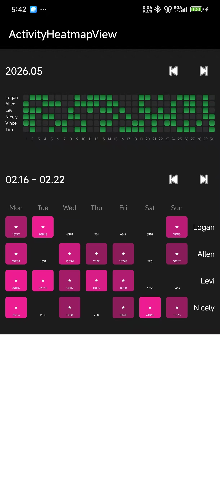

英文文档 [English Document](./README_EN.md)

* 活动热力图组件 (ActivityHeatmapView)
*
* 这是一个用于展示频率数据的自定义 View，类似于 GitHub 的提交记录或健身打卡记录。

## 引入

### Gradle:

1. 在Project的 **build.gradle** 或 **setting.gradle** 中添加远程仓库

    ```gradle
    repositories {
        //
        mavenCentral()
    }
    ```

2. 在Module的 **build.gradle** 中添加依赖项
   [](https://central.sonatype.com/artifact/io.github.logan0817/ActivityHeatmapView)

    ```gradle
   implementation 'io.github.logan0817:ActivityHeatmapView:1.0.0' // 替换为上方徽章显示的最新版本
    ```

## 效果展示



> Demo.apk [点击下载](apk/app-debug.apk)

## 背景流光效果效果使用：ShimmerView

```kotlin
<com.logan.shinningviewapp.ActivityHeatmapView
android:id = "@+id/activityHeatmapView"
android:layout_width = "match_parent"
android:layout_height = "wrap_content"

app:ahvInactiveColorEnd = "#2B2A2C"
app:ahvInactiveColorStart = "#2B2A2C"

app:ahvActiveColorStart = "#ED1C91"
app:ahvActiveColorEnd = "#FF6FBF"

app:ahvCellGap = "9dp"
app:ahvCellCornerRadius = "4dp"

app:ahvLabelGridGap = "10dp"
app:ahvLabelTextColor = "#FFFFFF"
app:ahvLabelTextSize = "14sp"

app:ahvHeaderGridGap = "8dp"
app:ahvHeaderTextColor = "#888888"
app:ahvHeaderTextSize = "12sp" />
```

## 控件参数及含义

| *参数名*                 |    *参数取值* |     *参数含义*      |
|-----------------------|----------:|:---------------:|
| ahvActiveColorStart   |     color |     激活渐变色-顶     |
| ahvActiveColorEnd     |     color |     激活渐变色-底     |
|                       |           |                 |
| ahvInactiveColorStart |     color |    未激活渐变色-顶     |
| ahvInactiveColorEnd   |     color |    未激活渐变色-底     |
|                       |           |                 |
| ahvCellGap            | dimension |     方块之间间距      |
| ahvCellCornerRadius   | dimension |     方块圆角大小      |
|                       |           |                 |
| ahvLabelGridGap       | dimension |  Y轴 (Label)间距   |
| ahvLabelTextColor     |     color | Y轴 (Label)文字颜色  |
| ahvLabelTextSize      | dimension | Y轴 (Label)文字大小  |
|                       |           |                 |
| ahvHeaderGridGap      | dimension |  X轴 (Header)间距  |
| ahvHeaderTextColor    |     color |  X轴 (Header)颜色  |
| ahvHeaderTextSize     | dimension | X轴 (Header)文字大小 |


### 如果你有任何疑问可以留言。
### 如果对你有帮助，可以赏个star支持一下作者。

### License

```
MIT License

Copyright (c) 2025 Logan Gan

Permission is hereby granted, free of charge, to any person obtaining a copy
of this software and associated documentation files (the "Software"), to deal
in the Software without restriction, including without limitation the rights
to use, copy, modify, merge, publish, distribute, sublicense, and/or sell
copies of the Software, and to permit persons to whom the Software is
furnished to do so, subject to the following conditions:

The above copyright notice and this permission notice shall be included in all
copies or substantial portions of the Software.

THE SOFTWARE IS PROVIDED "AS IS", WITHOUT WARRANTY OF ANY KIND, EXPRESS OR
IMPLIED, INCLUDING BUT NOT LIMITED TO THE WARRANTIES OF MERCHANTABILITY,
FITNESS FOR A PARTICULAR PURPOSE AND NONINFRINGEMENT. IN NO EVENT SHALL THE
AUTHORS OR COPYRIGHT HOLDERS BE LIABLE FOR ANY CLAIM, DAMAGES OR OTHER
LIABILITY, WHETHER IN AN ACTION OF CONTRACT, TORT OR OTHERWISE, ARISING FROM,
OUT OF OR IN CONNECTION WITH THE SOFTWARE OR THE USE OR OTHER DEALINGS IN THE
SOFTWARE.
```
